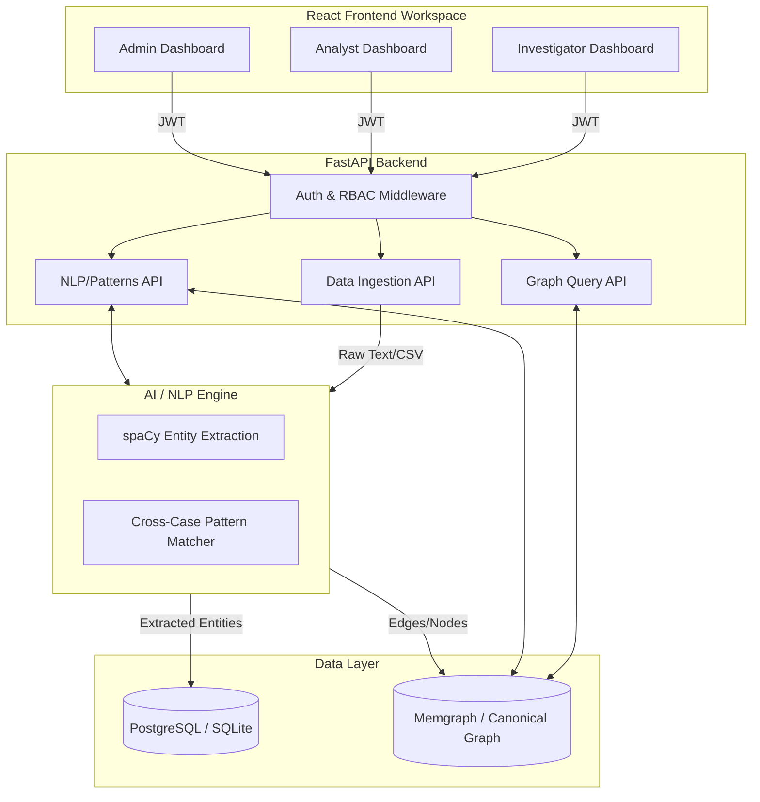

# System Architecture

## Overview
The AI-Powered Criminal Network Analysis System (SIH 2026 - PS 26189) is designed to process multi-source intelligence, construct a canonical knowledge graph of criminal entities, and present actionable insights to investigators.

## Tech Stack
*   **Frontend**: React (Vite) + Tailwind CSS (Lucide-react icons, Recharts for analytics)
*   **Backend API**: FastAPI (Python 3.9+)
*   **Graph Database**: Memgraph (Production) / `LocalFixtureStore` via JSON (Current Demo Mode)
*   **Evidence / Relational DB**: PostgreSQL / SQLite (stores users, cases, audit logs)
*   **NLP Pipeline**: spaCy (Entity Extraction, Link Prediction)

## Architecture Diagram

## Security & Integrity
*   **RBAC**: Investigator (Read/Ingest), Analyst (Approve/Reject patterns), Admin (User/System Management).
*   **Tamper-Proof Audit Log**: A cryptographic hash chain secures all ingestion, modification, and login events.
*   **Merkle-based Integrity**: Extracted evidence is locally hashed to verify no tampering occurred post-ingestion.

## Data Flow Pipeline
1.  **Ingestion**: Files (FIRs, CDRs, Financial ledgers) are uploaded.
2.  **Extraction**: Entities (Persons, Phone Numbers, Accounts, Vehicles, Locations) are extracted.
3.  **Resolution**: The AI flags possible duplicates or linked entities for Analyst review.
4.  **Graph Synthesis**: Edges are formed (e.g. `COMMUNICATES_WITH`, `FINANCIAL_TRANSFER_TO`).
5.  **Pattern Detection**: High-betweenness nodes (bridges) and structuring patterns are flagged.
